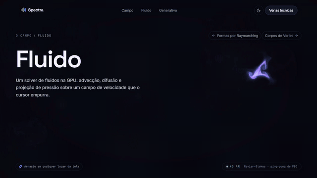
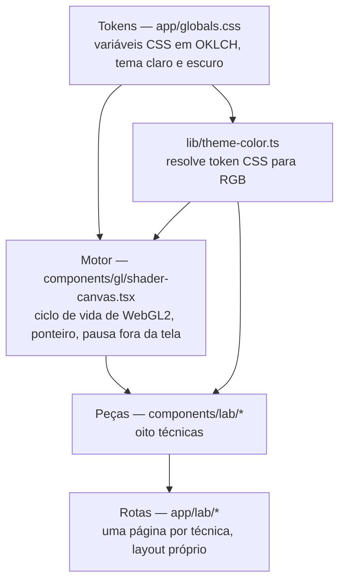
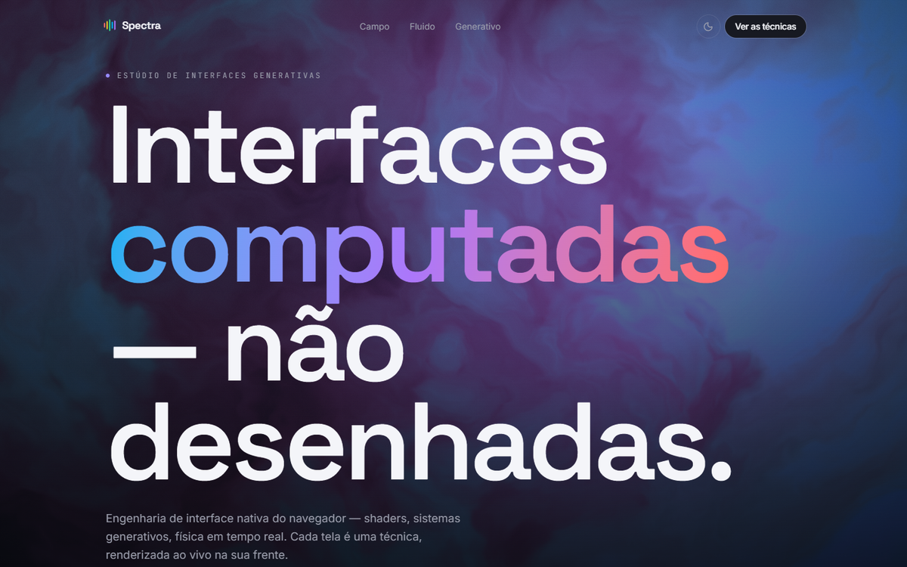
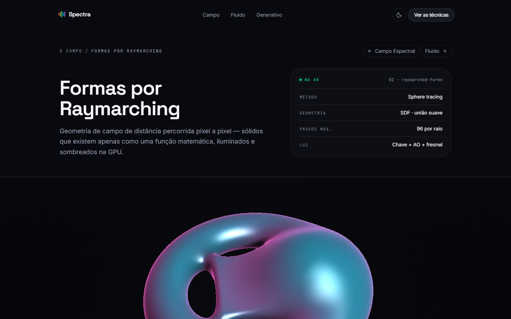

# Spectra

Um site cujas telas não são imagens: cada uma é um programa que desenha a si
mesmo, quadro a quadro, enquanto está sendo usada.



[Como rodar](#como-rodar) · [Garantias](#garantias) ·
[Alternativas consideradas](#alternativas-consideradas) ·
[Limitações](#limitações)

## Visão geral

O visual de um site costuma ser montado com peças estáticas: blocos, textos e
imagens exportadas de um editor de design. Aqui não há nenhum arquivo de imagem
de layout. O que aparece é calculado enquanto a página é usada — a simulação de
fluido acima responde ao cursor porque está resolvendo equações de escoamento a
cada quadro, não porque um vídeo está sendo reproduzido. O que torna isso
difícil é o orçamento: tudo precisa caber em milissegundos por quadro, sem
travar a rolagem, e ainda funcionar em máquinas sem placa de vídeo dedicada.

O repositório reúne oito técnicas desse tipo — shaders em GPU, um solver de
Navier–Stokes, física de corpos, composição procedural, animação ligada à
rolagem, tipografia variável e análise de áudio — sobre um design system único.
Sete delas têm página própria; a oitava é o campo que serve de fundo à home.

O documento abre pelas garantias porque é o que distingue código que funciona na
máquina do autor de código que se pode confiar: cada afirmação abaixo é seguida
do comando que a verifica.

## Garantias

| Invariante | Comando que prova |
| --- | --- |
| Todas as rotas são pré-renderizadas como conteúdo estático — nenhuma depende de servidor em tempo de requisição | `npm run build` (marca `○ (Static)` em todas) |
| O projeto compila sem nenhum erro de tipo, com `strict` e `noUncheckedIndexedAccess` ligados | `npm run typecheck` |
| Nenhuma violação de lint, incluindo as regras de acessibilidade de `eslint-plugin-jsx-a11y` que `eslint-config-next` aplica | `npm run lint` |
| Nenhuma dependência com vulnerabilidade conhecida, incluindo as transitivas | `npm audit` |
| Ausência de violações WCAG 2.1 AA nas rotas, nos dois temas | *a preencher* — [tarefa](docs/readme-gaps.md) |
| Uma única animação por peça (nenhum laço de renderização duplicado) | *a preencher* — [tarefa](docs/readme-gaps.md) |
| Os cabeçalhos de segurança declarados em `next.config.ts` chegam a todas as respostas | *a preencher* — [tarefa](docs/readme-gaps.md) |

## Como rodar

Requer Node.js 20.9 ou superior (declarado em `engines`).

```bash
npm install
npm run dev
```

A aplicação sobe em `http://localhost:3000`.

Para servir a versão de produção, que é a que aplica a política de segurança
estrita:

```bash
npm run build
npm run start
```

## Arquitetura

Os tokens de cor estão na base; o motor de shaders e as peças consomem os mesmos
valores; as rotas montam as peças. Nada abaixo depende do que está acima:



O motor de shaders é compartilhado: `ShaderCanvas` é dono de todo o ciclo de
vida — triângulo de tela cheia, ponteiro suavizado, laço que pausa fora da
viewport e em aba oculta, quadro único estático quando o sistema pede movimento
reduzido, retorno para gradiente CSS onde WebGL2 não existe, e liberação dos
recursos. Cada shader recebe o mesmo contrato de uniformes (`u_res`, `u_mouse`,
`u_time`, `u_theme`, `u_active`, `u_bg`), então uma técnica nova é um fragment
shader e nada mais.

Cor é declarada uma vez. Os tokens vivem como variáveis CSS e o Tailwind os
reexporta como utilitários; o que pinta fora do CSS — canvas 2D e shaders — lê
os mesmos tokens através de `lib/theme-color.ts`, que resolve o valor pintando-o
em um canvas de 1×1 e lendo o pixel. `getComputedStyle` devolve a string
original (`oklch(...)`, às vezes `lab(...)`), e essa é a única conversão que
acompanha qualquer espaço de cor que o navegador aceite. Trocar de tema repinta
as simulações sem tocar no estado delas.

Stack: Next.js 16 (App Router, Turbopack), React 19, TypeScript 6, Tailwind CSS
v4, Motion para a entrada do hero, e WebGL2/GLSL escrito à mão.

```text
app/            rotas; uma pasta por técnica, cada página com layout próprio
components/gl/  motor de shaders
components/lab/ as oito técnicas
components/ui/  botão, reveal, badge de status
lib/            algoritmos puros (geração procedural, cor, easing)
```

### As técnicas

| Técnica | O que roda |
| --- | --- |
| Campo espectral | Ruído fractal com deformação de domínio, atrator no ponteiro; é o fundo da home |
| Formas por raymarching | Sphere tracing sobre campos de distância, união suave, sombra de penumbra e oclusão de ambiente por pixel |
| Fluido | Solver de Navier–Stokes na GPU: advecção, confinamento de vorticidade, 20 iterações de Jacobi para a pressão, ping-pong entre texturas de ponto flutuante |
| Corpos de Verlet | Integração por posição, colisão resolvida por massa, molas de distância, 6 relaxamentos de restrição por quadro |
| Composições generativas | PRNG mulberry32 e subdivisão recursiva; a mesma semente reproduz a mesma composição |
| Scroll cinematográfico | Quatro atos em `view-timeline` do CSS, sem nenhum listener de rolagem e sem JavaScript de cliente |
| Tipografia cinética | Eixos de fonte variável por glifo; a linha assenta e o laço de animação termina |
| Áudio reativo | FFT de 2048 pontos; o próprio som é sintetizado em Web Audio, então a peça não exige arquivo nem microfone |



*O campo espectral: ruído fractal deformado em tempo real, com o ponteiro
funcionando como atrator.*



*Formas por raymarching: nenhuma malha é enviada à GPU — a geometria existe
apenas como função de distância, percorrida por pixel.*

## Alternativas consideradas

**Renderização: WebGL2 direto, não three.js.** As peças precisam de um fragment
shader de tela cheia e de um triângulo — não de grafo de cena, câmeras ou
carregadores de modelo. A biblioteca custaria centenas de kilobytes para
esconder as poucas chamadas que são justamente o assunto do projeto.

**Movimento na entrada: `view-timeline` do CSS, não observadores em
JavaScript.** As revelações e o scroll cinematográfico rodam no compositor, sem
handler de rolagem. O conteúdo é escrito no estado final e visível; a animação
só se liga onde há suporte e o sistema não pede movimento reduzido. Um
`IntersectionObserver` traria o custo de JavaScript e deixaria a página em
branco caso ele falhasse.

**TypeScript 6, não 7.** O compilador nativo já foi lançado, mas
`typescript-eslint`, que chega via `eslint-config-next`, ainda não o suporta —
adotá-lo quebraria o lint. A linha estável é a que toda a cadeia de ferramentas
sustenta.

**ESLint 9, não 10.** O `eslint-plugin-react` embutido no `eslint-config-next`
16 usa `context.getFilename()`, removido no ESLint 10.

**Cor em canvas: leitura do token, não valores duplicados.** A alternativa
comum é repetir a paleta em JavaScript. Isso cria duas fontes de verdade que
divergem no primeiro ajuste de tema — o probe de canvas mantém uma só.

**Segurança: CSP com `'unsafe-inline'` em `script-src`, não nonce por
requisição.** O script que resolve o tema antes da primeira pintura e os blocos
de hidratação do Next são inline. Nonce exigiria middleware, e middleware
tornaria dinâmica cada uma das rotas hoje estáticas. Para um site sem entrada de
terceiros por onde injetar script, o custo não se justifica. O restante da
política é estrito: `object-src 'none'`, `base-uri`, `form-action` e
`frame-ancestors 'none'`.

**Dependências: `overrides`, não atualização do framework.** O Next 16.2.11
carrega `postcss` e `sharp` vulneráveis como dependências transitivas, e não há
versão estável do framework que os corrija. Os `overrides` em `package.json`
elevam as duas — `sharp` sequer é exercitado, já que o projeto não usa
`next/image`.

**Áudio: síntese, não arquivo nem microfone.** Um arquivo somaria peso e uma
licença; exigir microfone barraria a peça atrás de uma permissão. A Web Audio
gera o sinal e o analisa, então a técnica funciona para qualquer visitante — o
microfone segue disponível como segunda fonte.

## Desempenho

*a preencher* — não há medição reproduzível no repositório;
[tarefa](docs/readme-gaps.md).

## Verificação

O que roda hoje, e o que cada comando cobre:

| Comando | Cobertura |
| --- | --- |
| `npm run typecheck` | Tipos de todo o projeto, sem emitir saída |
| `npm run lint` | Regras do `eslint-config-next`, incluindo acessibilidade em JSX e as regras de hooks do React |
| `npm run build` | Compilação de produção e pré-renderização das rotas; falha se qualquer página quebrar na geração estática |
| `npm audit` | Vulnerabilidades conhecidas na árvore de dependências |

Não há testes automatizados — ver [Limitações](#limitações) e as tarefas em
[`docs/readme-gaps.md`](docs/readme-gaps.md).

## Limitações

- **Sem testes automatizados.** As verificações acima são estáticas: nenhuma
  executa as peças e afirma o comportamento delas.
- **Sem camada de dados.** Não há backend, autenticação ou persistência; o
  projeto é inteiramente cliente e conteúdo estático.
- **WebGL2 é obrigatório para três peças** — campo espectral, raymarching e
  fluido. Onde ele não existe, cada uma cai para um gradiente CSS estático, e a
  técnica em si não é vista. As outras cinco rodam em canvas 2D, SVG, CSS ou
  DOM, e não dependem de GPU programável.
- **O tema escuro ignora a preferência do sistema na primeira visita.** É
  deliberado: o escuro é a base do design system. A escolha do visitante
  persiste a partir do primeiro clique no seletor.
- **A CSP publicada permite script inline.** Explicado em
  [Alternativas consideradas](#alternativas-consideradas).
- **Interface apenas em português.** Não há infraestrutura de internacionalização.
- **Animação ligada à rolagem depende de `view-timeline`.** Onde não há suporte,
  o conteúdo aparece no estado final, sem a sequência.

## Licença

Nenhuma licença é concedida. O código está publicado para leitura; todos os
direitos são reservados ao autor.
